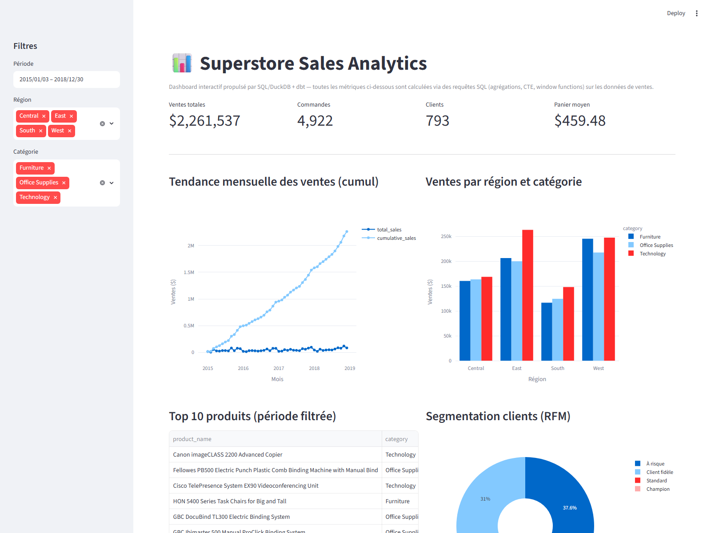

# 📊 Superstore Sales Analytics — SQL & dbt

Pipeline analytique complet en **SQL avancé** (dbt + DuckDB) sur les ventes d'un magasin (dataset [Superstore](https://www.kaggle.com/datasets), 9 800 commandes, 2015-2018), avec un **dashboard web interactif** en bout de chaîne.

> Objectif du projet : démontrer une maîtrise pratique du SQL — CTE, window functions, agrégations, tests de qualité de données — sur un cas métier réaliste (analyse de ventes retail).

**[🔗 Voir le dashboard en ligne](https://superstore-sql-analytics-ua2wgmwcrhhd3ezu6nzaaw.streamlit.app/)**



## Ce que ce projet démontre

| Compétence SQL | Où |
|---|---|
| Nettoyage & typage de données brutes (dates, dédoublonnage) | [`stg_superstore.sql`](dbt/models/staging/stg_superstore.sql) |
| Modélisation dimensionnelle (star schema) : clés primaires/étrangères, clé de substitution | [`models/warehouse/`](dbt/models/warehouse/) |
| CTE multi-étapes | tous les modèles `marts/` |
| Jointures multi-tables (fact ⋈ dimensions) | tous les modèles `marts/` |
| Window functions : `SUM() OVER`, `LAG()`, cumul & croissance MoM | [`mart_monthly_sales.sql`](dbt/models/marts/mart_monthly_sales.sql) |
| Classement : `RANK()`, `ROW_NUMBER()`, `QUALIFY` | [`mart_region_category.sql`](dbt/models/marts/mart_region_category.sql), [`mart_top_products.sql`](dbt/models/marts/mart_top_products.sql) |
| Segmentation client (RFM) : `NTILE()`, `DATE_DIFF`, `CASE` | [`mart_customer_summary.sql`](dbt/models/marts/mart_customer_summary.sql) |
| Agrégations temporelles (délai de livraison) | [`mart_shipping_performance.sql`](dbt/models/marts/mart_shipping_performance.sql) |
| Tests de qualité de données : PK (`unique`, `not_null`) et FK (`relationships`) | [`warehouse/schema.yml`](dbt/models/warehouse/schema.yml) |
| Requêtes paramétrées dynamiques (filtres du dashboard) | [`dashboard/app.py`](dashboard/app.py) |

## Architecture

```
superstore.csv (source brute)
        │
        ▼
   dbt (DuckDB)
   ├── staging    : nettoyage, typage, dédoublonnage
   ├── warehouse  : schéma en étoile — fact_sales + 5 dimensions (PK/FK)
   └── marts      : 5 modèles d'analyse métier, construits par jointure sur le schéma en étoile
        │
        ▼
   superstore.duckdb (entrepôt de données, un simple fichier)
        │
        ▼
   Dashboard Streamlit + Plotly (requêtes SQL en direct, jointures fact ⋈ dimensions)
```

**Pourquoi DuckDB plutôt que Postgres ?** Zéro serveur à installer, zéro identifiant à configurer : n'importe qui peut cloner ce repo et lancer `dbt build` immédiatement. Le SQL reste standard (CTE, window functions, jointures) et transposable tel quel sur Postgres/Snowflake/BigQuery.

## Schéma en étoile

**`fact_sales`** (grain = une ligne produit dans une commande) référence 5 dimensions par clé étrangère :

| Dimension | Clé primaire | Contenu |
|---|---|---|
| [`dim_customer`](dbt/models/warehouse/dim_customer.sql) | `customer_id` | nom, segment |
| [`dim_product`](dbt/models/warehouse/dim_product.sql) | `product_id` | nom, catégorie, sous-catégorie |
| [`dim_location`](dbt/models/warehouse/dim_location.sql) | `location_id` (clé de substitution) | ville, état, code postal, région, pays |
| [`dim_ship_mode`](dbt/models/warehouse/dim_ship_mode.sql) | `ship_mode` | mode d'expédition |
| [`dim_date`](dbt/models/warehouse/dim_date.sql) | `date_day` | calendrier complet (année, trimestre, mois, semaine ISO) |

Chaque FK de `fact_sales` est couverte par un test dbt `relationships` (intégrité référentielle vérifiée à chaque `dbt build`).

## Modèles dbt

**Staging**
- **`stg_superstore`** — table de staging : cast des types, parsing des dates, dédoublonnage sur `row_id`.

**Warehouse (schéma en étoile)**
- **`fact_sales`** + **`dim_customer`**, **`dim_product`**, **`dim_location`**, **`dim_ship_mode`**, **`dim_date`** (voir tableau ci-dessus).

**Marts (analyse métier, construits par jointure sur le schéma en étoile)**
- **`mart_monthly_sales`** — ventes mensuelles, cumul (running total) et croissance mois sur mois.
- **`mart_region_category`** — ventes par région/catégorie, classement de chaque catégorie au sein de sa région.
- **`mart_top_products`** — top 10 produits par catégorie (`ROW_NUMBER` partitionné).
- **`mart_customer_summary`** — segmentation RFM (récence / fréquence / montant) par client.
- **`mart_shipping_performance`** — délai de livraison moyen par mode d'expédition et région.

41 tests dbt (`unique`, `not_null`, `accepted_values`, `relationships`) garantissent la qualité des données et l'intégrité référentielle à chaque `dbt build`.

## Lancer le projet en local

Prérequis : Python 3.11+.

```bash
git clone <url-du-repo>
cd superstore-sql-analytics

python -m venv .venv
.venv\Scripts\activate          # Windows
# source .venv/bin/activate     # macOS/Linux

pip install -r requirements.txt

# Construire l'entrepôt de données (staging + marts + tests)
cd dbt
dbt build --profiles-dir . --project-dir .
cd ..

# Lancer le dashboard
streamlit run dashboard/app.py
```

Le dashboard s'ouvre sur `http://localhost:8501` et se reconstruit automatiquement (`dbt build`) au premier lancement si l'entrepôt n'existe pas encore.

## Déployer le dashboard

Ce projet est prêt pour [Streamlit Community Cloud](https://streamlit.io/cloud) (gratuit) :

1. Pousser ce repo sur GitHub.
2. Sur [share.streamlit.io](https://share.streamlit.io), créer une nouvelle app en pointant vers ce repo, fichier principal `dashboard/app.py`.
3. Le premier lancement exécute automatiquement `dbt build` pour reconstruire l'entrepôt à partir de `data/superstore.csv`.
4. Ajouter le lien obtenu en haut de ce README.

## Structure du repo

```
data/superstore.csv          # données sources
dbt/
  dbt_project.yml
  profiles.yml
  models/
    staging/                 # nettoyage
    warehouse/                # schéma en étoile : fact_sales + dimensions (PK/FK)
    marts/                    # modèles d'analyse, jointures sur le schéma en étoile
dashboard/app.py             # dashboard Streamlit + Plotly
requirements.txt
```
